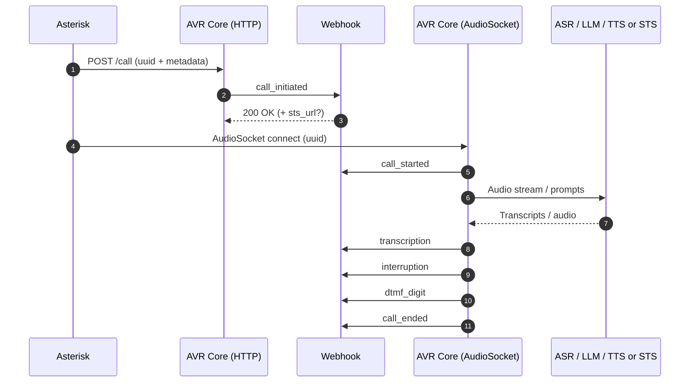

# How AVR Works

The AVR Infrastructure project provides a complete, modular deployment environment for the **Agent Voice Response (AVR)** system.

It allows you to deploy **AVR Core**, **ASR (Automatic Speech Recognition)**, **LLM (Large Language Model)**, **TTS (Text-to-Speech)**, or a unified **STS (Speech-to-Speech)** service, all integrated with **Asterisk PBX** using the **AudioSocket protocol**.

AVR supports a wide range of providers, including cloud services such as **OpenAI, Deepgram, Google, ElevenLabs, Anthropic**, as well as **local and open-source providers** like **Vosk, Kokoro, CoquiTTS, and Ollama**.
The entire stack can be customized and deployed using **Docker Compose**.

## Prerequisites

Before starting, ensure the following tools and credentials are available:

* Docker and Docker Compose
* API keys for cloud providers you plan to use
* (Optional) SIP client for testing (e.g. Telephone, MicroSIP, GNOME Calls)
* (Optional) Local ASR / TTS / LLM services if using open-source providers

## High-Level Architecture

AVR follows a **modular and provider-agnostic architecture**.

<br>
<div align="center">
  
</div>
<br>

At runtime, AVR Core acts as the **orchestrator** between Asterisk and the configured AI services.

## Call Lifecycle Overview

At a high level, a call handled by AVR follows this lifecycle:

1. Call metadata is initialized (HTTP)
2. Audio streaming starts (AudioSocket)
3. Speech is processed (ASR → LLM → TTS or STS)
4. Audio is streamed back to the caller
5. Call terminates and resources are released

The sections below describe each step in detail.

## 0) Call Initialization (Asterisk → AVR Core HTTP)

Before audio streaming begins, the call can be **explicitly initialized via HTTP**.

This step is optional but strongly recommended, as it enables:

* call metadata propagation
* webhook-based routing
* dynamic STS selection

### Flow

* The Asterisk dialplan:

  * generates a **UUID**
  * sends a `POST /call` request to AVR Core
  * includes call metadata (caller, extension, uniqueid, channel, etc.)

* AVR Core:

  * stores the metadata
  * emits the **`call_initiated`** webhook
  * optionally allows a webhook to override the **STS URL**

See also:

* **AVR Core HTTP Web Service**
* **Webhook Integration Guide**

## Call Lifecycle (HTTP, AudioSocket, Webhooks)



## 1) Audio Ingestion (Asterisk → AVR Core AudioSocket)

Once the call is initialized, Asterisk opens a **TCP AudioSocket** connection to AVR Core.

From the dialplan:

* the same `UUID` used in `POST /call` is passed to AudioSocket
* Asterisk streams real-time audio frames to AVR Core

AVR Core responsibilities:

* accept the AudioSocket connection
* normalize audio format if needed
* segment audio into streaming chunks

## 2) Transcription (AVR Core → ASR)

When using the classic pipeline:

1. AVR Core streams audio chunks to the ASR service (`ASR_URL`)
2. The ASR returns:

   * partial transcripts (interim)
   * final transcripts (utterance completed)
3. AVR Core:

   * buffers partials
   * emits a final transcript when stabilized

The **final transcript** triggers the reasoning step.

## 3) Reasoning and Response (AVR Core → LLM)

1. AVR Core sends the final transcript and conversation context to the LLM (`LLM_URL`)
2. The LLM generates the assistant response:

   * streaming tokens, or
   * a complete text response

AVR Core handles provider-specific streaming and normalization.

## 4) Voice Rendering (AVR Core → TTS)

1. The LLM response text is sent to the TTS service (`TTS_URL`)
2. TTS produces audio frames
3. AVR Core streams the audio back to Asterisk over the existing AudioSocket

The caller hears the response with **minimal latency**.

## Alternative Path: Speech-to-Speech (STS)

If `STS_URL` is configured, AVR Core bypasses ASR, LLM, and TTS entirely.

Caller speech is sent directly to the STS provider, which returns synthesized speech.

This approach:

* reduces latency
* simplifies the pipeline
* is ideal for real-time conversational agents

<br>
<div align="center">
  
</div>
<br>

STS routing can be **static** or **dynamic** via the `call_initiated` webhook.

## What the Caller Experiences

From the caller’s perspective:

1. They speak naturally
2. AVR processes speech in real time
3. Responses are generated and spoken back
4. Interruptions and DTMF are handled seamlessly
5. The interaction feels conversational and responsive

## Your First Agent in Under 5 Minutes

Use one of the preconfigured Docker Compose files to launch AVR with your preferred providers.

### Steps

```console
git clone https://github.com/agentvoiceresponse/avr-infra
cd avr-infra
cp .env.example .env
```

Run a stack, for example:

```console
docker-compose -f docker-compose-openai.yml up -d
```

Or with local providers:

```console
docker-compose -f docker-compose-local.yml up -d
```

Edit `.env` with your provider credentials.

## Configuration Summary (AVR Core)

### Classic Pipeline

* `ASR_URL`
* `LLM_URL`
* `TTS_URL`

### STS Pipeline

* `STS_URL` (ASR / LLM / TTS disabled)

```yaml
ASR_URL=http://avr-asr-deepgram:6010/speech-to-text-stream
LLM_URL=http://avr-llm-anthropic:6000/prompt-stream
TTS_URL=http://avr-tts-google:6003/text-to-speech-stream
STS_URL=http://avr-sts-openai:6033/speech-to-speech-stream
```

Hostnames and ports depend on your Docker Compose configuration.
