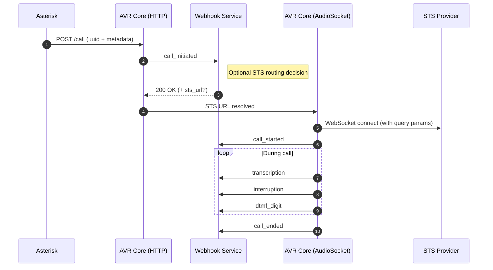

# Webhook Integration Guide

AVR Core provides a flexible webhook system that allows external services to receive **real-time notifications about call lifecycle events**.

Webhooks can be used for:

* dynamic routing decisions
* analytics and monitoring
* CRM and backend integrations
* call correlation with external systems

This guide explains all supported webhook events, their payloads, and best practices for implementing webhook receivers.

## Overview

Webhooks are HTTP `POST` requests sent by AVR Core to a configured endpoint (`WEBHOOK_URL`) whenever a specific event occurs during a call session.

Each webhook:

* is emitted synchronously with the event
* follows a consistent JSON structure
* is correlated using a unique `uuid`

Some webhooks are **informational**, while others (notably `call_initiated`) can be used to **influence call routing behavior**.


## Call Lifecycle and Webhooks

A typical AVR call lifecycle with webhooks enabled follows this sequence:

1. **`call_initiated`**
   Triggered when call metadata is received via HTTP (`POST /call`)

2. **`call_started`**
   Triggered when the AudioSocket connection is established

3. **Runtime events**
   `transcription`, `interruption`, `dtmf_digit`

4. **`call_ended`**
   Triggered when the call session terminates

The `call_initiated` event is tightly coupled with the HTTP Web Service and is emitted **before any audio processing starts**.

See also:
👉 **AVR Core HTTP Web Service**
[https://wiki.agentvoiceresponse.com/en/avr-core-http-web-service](https://wiki.agentvoiceresponse.com/en/avr-core-http-web-service)


## Call Lifecycle & Webhooks

The following diagram illustrates how HTTP, AudioSocket, STS, and Webhooks interact during a call lifecycle.



### Diagram Notes

* **`call_initiated`**

  * emitted before audio starts
  * receives call metadata
  * may override `STS_URL`

* **`call_started`**

  * marks the beginning of audio streaming

* **Runtime events**

  * emitted while the call is active
  * informational only

* **`call_ended`**

  * final lifecycle event


## Supported Webhook Events

### `call_initiated`

* **Trigger**: `POST /call` received by AVR Core
* **Phase**: Pre-call
* **Payload**: Call metadata
* **Special behavior**:
  The webhook **may return `sts_url`** to dynamically override STS routing

This is the **only webhook event** that supports routing decisions via HTTP response.

```json
{
  "uuid": "935652e3-7c59-4edc-b17f-9646a9c2a265",
  "type": "call_initiated",
  "timestamp": "2026-01-01T12:00:00.000Z",
  "payload": {
    "from": "2000",
    "to": "5001",
    "uniqueid": "1770758888.32",
    "channel": "PJSIP/2000-00000013"
  }
}
```


### `call_started`

* **Trigger**: AudioSocket connection established
* **Payload**: Empty
* **Use cases**:

  * start timers
  * mark call as active

```json
{
  "uuid": "550e8400-e29b-41d4-a716-446655440000",
  "type": "call_started",
  "timestamp": "2024-01-01T12:00:00.000Z",
  "payload": {}
}
```


### `call_ended`

* **Trigger**: Call termination
* **Payload**: Empty
* **Use cases**:

  * finalize analytics
  * persist call results

```json
{
  "uuid": "550e8400-e29b-41d4-a716-446655440000",
  "type": "call_ended",
  "timestamp": "2024-01-01T12:05:30.000Z",
  "payload": {}
}
```


### `interruption`

* **Trigger**: User interrupts AI speech
* **Payload**: Empty
* **Use cases**:

  * engagement analysis
  * barge-in detection

```json
{
  "uuid": "550e8400-e29b-41d4-a716-446655440000",
  "type": "interruption",
  "timestamp": "2024-01-01T12:02:15.000Z",
  "payload": {}
}
```


### `transcription`

* **Trigger**: Speech transcription event
* **Payload**: Role and text
* **Use cases**:

  * conversation logging
  * QA and auditing

```json
{
  "uuid": "550e8400-e29b-41d4-a716-446655440000",
  "type": "transcription",
  "timestamp": "2024-01-01T12:01:45.000Z",
  "payload": {
    "role": "user | agent",
    "text": "Hello, I need help with my account"
  }
}
```


### `dtmf_digit` (Asterisk 22+)

* **Trigger**: DTMF key pressed
* **Payload**: Digit value
* **Use cases**:

  * hybrid IVR flows
  * keypad input handling

```json
{
  "uuid": "550e8400-e29b-41d4-a716-446655440000",
  "type": "dtmf_digit",
  "timestamp": "2024-01-01T12:02:15.000Z",
  "payload": {
    "digit": "1"
  }
}
```


## Common Webhook Payload Format

All webhook events share the same envelope structure:

```json
{
  "uuid": "550e8400-e29b-41d4-a716-446655440000",
  "type": "event_type",
  "timestamp": "ISO-8601",
  "payload": {}
}
```


## Configuration

### Environment Variables

#### Required

* `WEBHOOK_URL` – Webhook receiver endpoint

#### Optional

* `WEBHOOK_SECRET` – Shared secret for verification
* `WEBHOOK_TIMEOUT` – Request timeout (default: 3000 ms)
* `WEBHOOK_RETRY` – Retry attempts (default: 0)

```bash
WEBHOOK_URL=http://avr-webhook:9000/events
WEBHOOK_SECRET=your-secret-key
WEBHOOK_TIMEOUT=5000
WEBHOOK_RETRY=3
```


## Security

If `WEBHOOK_SECRET` is configured, AVR Core sends it in the request header:

```http
X-AVR-WEBHOOK-SECRET: your-secret-key
```

Webhook endpoints should:

* verify the secret
* be reachable only from trusted networks
* be idempotent


## Minimal Express Webhook Example

The following example shows a minimal Express.js webhook receiver supporting all AVR webhook events.

```js
const express = require("express");
const app = express();

app.use(express.json());

app.post("/events", (req, res) => {
  const { uuid, type, payload } = req.body;

  switch (type) {
    case "call_initiated":
      console.log("Call initiated:", payload);
      return res.status(200).json({
        sts_url: `ws://localhost:6030?uuid=${uuid}`,
      });

    case "call_started":
      console.log("Call started:", uuid);
      break;

    case "transcription":
      console.log(`[${payload.role}] ${payload.text}`);
      break;

    case "interruption":
      console.log("User interrupted the agent");
      break;

    case "dtmf_digit":
      console.log("DTMF digit:", payload.digit);
      break;

    case "call_ended":
      console.log("Call ended:", uuid);
      break;

    default:
      console.log("Unhandled event:", type);
  }

  res.sendStatus(200);
});

app.listen(9000, () => {
  console.log("AVR webhook listener running on port 9000");
});
```

## Implementation Examples

To help you get started quickly, we provide ready-to-use examples that show how to connect AVR with external systems using webhooks.  
These examples demonstrate how to capture events, parse data, and trigger actions in your own applications.

- **GitHub Repository**: [agentvoiceresponse/avr-webhook](https://github.com/agentvoiceresponse/avr-webhook)  
  Contains sample webhook receivers and step-by-step instructions on how to integrate AVR with your stack.

## Event Capabilities Summary

| Event            | Phase     | Can Affect Routing |
| ---------------- | --------- | ------------------ |
| `call_initiated` | Pre-call  | ✅ Yes              |
| `call_started`   | Runtime   | ❌ No               |
| `transcription`  | Runtime   | ❌ No               |
| `interruption`   | Runtime   | ❌ No               |
| `dtmf_digit`     | Runtime   | ❌ No               |
| `call_ended`     | Post-call | ❌ No               |

## Error Handling and Retries

### Automatic Retry Logic

AVR Core implements automatic retry logic for failed webhook requests:

1. **Initial Request**: Webhook is sent to the configured URL
2. **Timeout Handling**: If no response within `WEBHOOK_TIMEOUT`, request is considered failed
3. **Retry Attempts**: Up to `WEBHOOK_RETRY` additional attempts are made
4. **Exponential Backoff**: Retry attempts are spaced with increasing delays
5. **Final Failure**: After all retries are exhausted, the webhook is logged as failed

### Error Logging

Failed webhook requests are logged with detailed error information:

```
[WEBHOOK][CALL_STARTED] Retry failed
Webhook Error:
Message: connect ECONNREFUSED avr-webhook:9000
Code: ECONNREFUSED
URL: http://avr-webhook:9000/events
Method: POST
Status: 
```

### Best Practices for Webhook Endpoints

1. **Fast Response**: Respond quickly (within timeout period)
2. **Idempotent Processing**: Handle duplicate webhook deliveries
3. **Error Handling**: Return appropriate HTTP status codes
4. **Logging**: Log all webhook events for debugging
5. **Security**: Verify webhook signatures when using secrets

## Common Issues and Solutions

#### Webhook Not Received
- **Check URL**: Verify `WEBHOOK_URL` is correct and accessible
- **Check Network**: Ensure network connectivity between AVR Core and webhook endpoint
- **Check Logs**: Review AVR Core logs for webhook delivery errors

#### Timeout Errors
- **Increase Timeout**: Set higher `WEBHOOK_TIMEOUT` value
- **Optimize Endpoint**: Improve webhook endpoint response time
- **Check Load**: Ensure webhook endpoint can handle request volume

#### Authentication Failures
- **Verify Secret**: Check `WEBHOOK_SECRET` configuration
- **Check Headers**: Ensure webhook endpoint reads `X-AVR-WEBHOOK-SECRET` header
- **Test Verification**: Implement and test signature verification logic

## Use Cases

Webhooks in AVR allow you to extend the platform beyond call handling, by sending events and call data to your own systems or third-party services.  
This makes it possible to enrich analytics, update business tools in real time, and ensure continuous quality improvements.

Here are some common scenarios:

### Call Analytics
Track key metrics like call duration, frequency, and interaction patterns.  
Useful for understanding customer behavior, optimizing agent performance, and measuring AI voicebot efficiency.


### CRM Integration
Automatically update customer profiles with call transcripts, notes, or outcomes.  
This ensures your sales and support teams always have the latest information at hand.


### Quality Assurance
Monitor AI performance, user satisfaction, and conversation quality.  
Webhook data can be connected to dashboards or QA tools to spot issues early and continuously improve your conversational flows.


## Related Documentation

* **AVR Core HTTP Web Service**
  [https://wiki.agentvoiceresponse.com/en/avr-core-http-web-service](https://wiki.agentvoiceresponse.com/en/avr-core-http-web-service)
